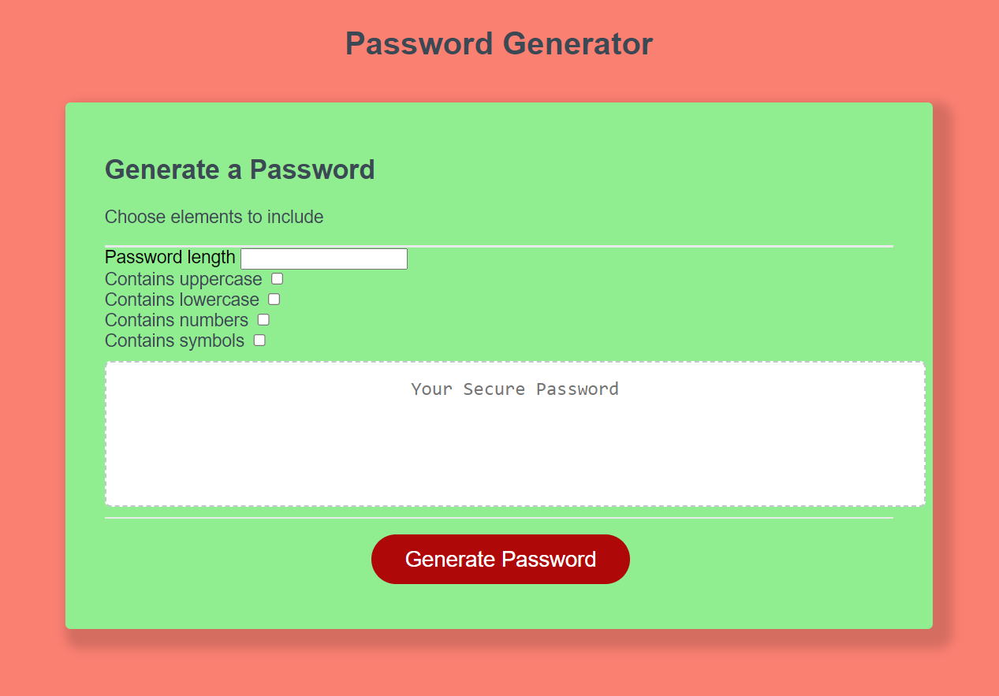

# Password-generator
## Description

Provide a short description explaining the what, why, and how of your project. Use the following questions as a guide:

- To create an accessisble password generator that is easy to use and secure. 
- Why did you build this project? To help increase the security of my data.
- What problem does it solve? Prevents me from using the same password algorithm for every password.
- What did you learn? The criteria for generating a password will affect its strength.

## Table of Contents (Optional)

If your README is long, add a table of contents to make it easy for users to find what they need.

- [Password-generator](#password-generator)
  - [Description](#description)
  - [Table of Contents (Optional)](#table-of-contents-optional)
  - [Installation](#installation)
  - [Usage](#usage)
  - [Credits](#credits)
  - [License](#license)
  - [Remarks](#remarks)

## Installation

Visit the page and start generating your passwords following the guided prompts. 

## Usage

Provide instructions and examples for use. Include screenshots as needed.

To add a screenshot, create an `assets/images` folder in your repository and upload your screenshot to it. Then, using the relative filepath, add it to your README using the following syntax:

    ```md
    
    ```
    [src = ]../assets/images/Screenshot.png

## Credits

https://www.youtube.com/watch?v=duNmhKgtcsI&t=930s

## License

MIT License

Copyright (c) 2023 Tshakalisa Khupe

Permission is hereby granted, free of charge, to any person obtaining a copy
of this software and associated documentation files (the "Software"), to deal
in the Software without restriction, including without limitation the rights
to use, copy, modify, merge, publish, distribute, sublicense, and/or sell
copies of the Software, and to permit persons to whom the Software is
furnished to do so, subject to the following conditions:

The above copyright notice and this permission notice shall be included in all
copies or substantial portions of the Software.

THE SOFTWARE IS PROVIDED "AS IS", WITHOUT WARRANTY OF ANY KIND, EXPRESS OR
IMPLIED, INCLUDING BUT NOT LIMITED TO THE WARRANTIES OF MERCHANTABILITY,
FITNESS FOR A PARTICULAR PURPOSE AND NONINFRINGEMENT. IN NO EVENT SHALL THE
AUTHORS OR COPYRIGHT HOLDERS BE LIABLE FOR ANY CLAIM, DAMAGES OR OTHER
LIABILITY, WHETHER IN AN ACTION OF CONTRACT, TORT OR OTHERWISE, ARISING FROM,
OUT OF OR IN CONNECTION WITH THE SOFTWARE OR THE USE OR OTHER DEALINGS IN THE
SOFTWARE.

## Remarks

The commits to this file are few because I initially started working on the starter 
code and when I tried to push the commits is when I found out that access was restricted. 